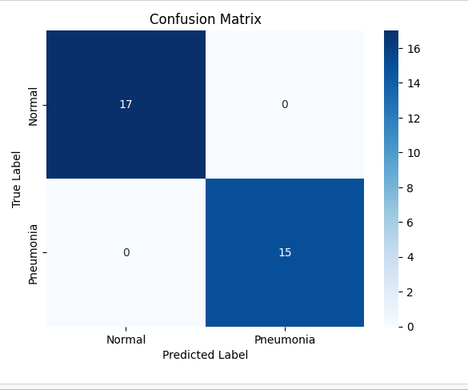

# pneumoniaImageClassifier
The repository contains code implementation of a pneumonia Image Classifier that identifies whether a given person has pneumonia or not using their x-ray chest images.\
The dataset used can be found on Kaggle, titled 'chest X-Ray Images(Pneumonia)'.Convolutional Neural Networks(CNN) were used to train the model.Refer to the model summary for more details on the Hidden Layers used. 

# Results 

To test the model performance, I used a batch of 32 images as indicated by the following Confusion Matrix 

Based on the confusion matrix, there are 17 true negatives (TN), 0 false positives (FP), 0 false negatives (FN), and 15 true positives (TP).  
Find within the ***img_classifier.ipynb*** a dataframe generated to show the ***Actual Value*** and ***Predicted Value*** of the **test data** used.  

# Limitations of the Model

To train the model, I used 197 X-Ray Images of People with Pneumonia(PNEUMONIA), 197 X-Ray Images of People without Pneumonia(NORMAL). 
I split this data into ***training data, validation data and test data***.  
This data is slightly lower to generate a perfect model.  

# Future Improvements
To develop a better model, I plan on using a pre-trained model such as ***VGG16*** or ***VGG19*** and a larger Chest X-Ray dataset, preferably 2GB. 

